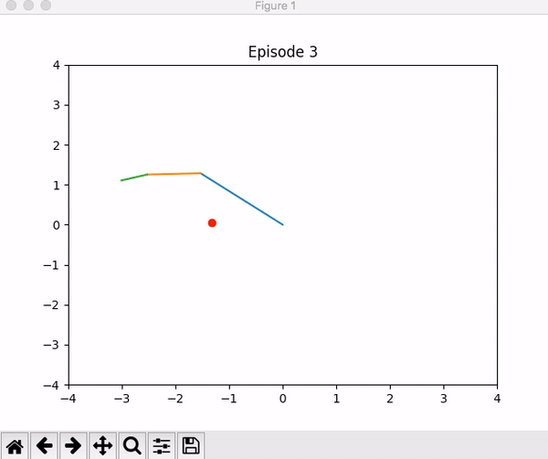
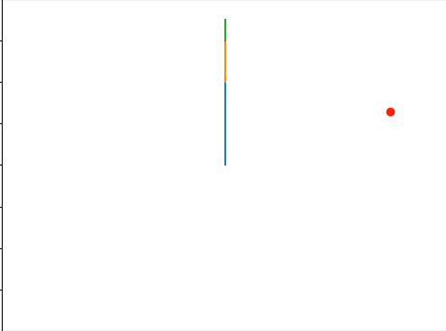

# rl-ik
Using Reinforcement Learning to solve an Inverse Kinematics Problem. I use RL to control the joints of a robot arm so 
that it's end-effector reaches a desired pose.

# About the Arm
I created a virtual robot arm. It's an arm that only moves around the x-y plane and there are 3 joints to control. 
The arm's reach is 3.5 and it's home position is when the joints are at [90,0,0] (shown below). The robot's joint
angles must be between -180 and 180. 

# How to run the code 
1. clone repo
2. cd into repo 
3. pip install -r requirements.txt (make sure openmpi is installed on your machine)
4. python inference.py 

# gym.Env info 
Name: ik-2D-3DOF-arm-v0

Observation Space: {robot end effector's goal position, robot end effector's current position. Box representation 

Action Space: Joint Delta Valuesbetween -5 and 5 degrees. (Multi) Discrete representation 

Rewards: 

  if dist(curr, goal) < 0.08 , reward = 1000 (episode ends)

  elif episode_limit(100) reached, reward = -10 (episode ends)

  elif joint limit violation , reward = -7

  else reward = -dist(curr, goal)

Note: At the beginning of each episode. I choose a random int from -180 and 180 for each joint. Then, calculate the Foward Kinematics
and set that value as the goal position. Because I'm choosing a random INTEGER, I can get away with a (multi) discrete action space. 

View ik_2D_3DOF_arm/envs/ik_2D_3DOF_arm.py to see full implementation 

# Agent info
I used stable-baseline's PPO implementation (PPO1 specifically). It took around 24 mins to train on my 7th generation core i7. It has around 97% accuracy and averages 25 steps for its successful episodes see (eval.py). I have uploaded this agent and use inference.py to see it in action (virtually). 

